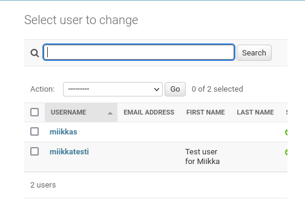
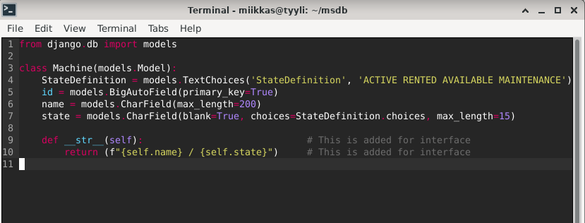

# h10-task

## Kone 

## a)

### Virtuaaliympäristö "virtualenv"

Aloitin asentamalla virtuaaliympäristön ``virtualenv`` virtuaalikoneelle. Komennolla ``$ sudo apt-get update`` hain ensin päivitykset, jonka jälkeen asensin ``virtualenv`` komennolla:

    $ sudo apt-get -y install virtualenv
    
Loin uuden virtuaaliympäristön ``virtualenv`` python3 paketin asentamiseksi komennolla

    $ virtualenv --system-site-packages -p python3 env/

  - Komento luo uuden ``env`` kansion, jossa on uusimmat paketit. ``--system-site-packages`` sallii virtuaaliympäristön ulkopuolisten pakettien asentamisen. 
  
Otin virtuaaliympäristön käyttöön komennolla ``$ source env/bin/activate``

``(env)`` ilmestyi alkuun, joten virtuaaliympäristö on nyt aktivoitu.

### Django

Asennan Djangon virtuaaliympäristöön. Asennus tapahtuu ``pip`` komennon avulla, sillä komento mahdollistaa vahvistamattomien pakettien asentamisen. Varmistan, että paketit asennetaan virtuaaliympäristöön komennolla ``$ which pip`` komento antoi vastaukseksi ``/home/miikkas/env/bin/pip`` eli asennus menee oikeaan tiedostopolkuun, luomaani ``env/`` kansioon eli virtuaaliympäristöön.

Loin Micro editorilla requirements.txt tekstitiedoston ``$ micro requirements.txt``. Kirjoitin tekstitiedostoon Python paketin nimen ``django``, tallensin ja poistuin. Tiedoston luominen varmistaa, että asennan oikean Python django paketin ``pip`` komennolla. Tämän avulla vältän mahdollisen kirjoitusvirheen asennuskomentoa antaessa. Pienikin kirjoitusvirhe paketin nimessä voisi johtaa mahdollisen haittallisen paketin asentamiseen.

Tarkistin vielä, että kirjoitin paketin oikein ``$ cat requirements.txt``. 

Paketin nimi oli oikein, joten jatkoin paketin asentamiseen. Asensin paketin komennolla 

        $ pip install -r requirements.txt
        
Asennuksen jälkeen tarkistin Djangon version komennolla ``$ django-admin --version`` 

Seuraavaksi loin uuden projektin Djangolla.

        $ django-admin startproject msdb

Tämän jälkeen testasin, että projekti toimii tuotannossa verkkosivulla. 
    - Siirryin projektiin ``$ cd msdb``
    - Käynnistin tuotantoa varten olevan serverin ``$ ./manage.py runserver``
    - Avasin projektin URL:n ``http://127.0.0.1:8000/``
    

Projektin asennus onnistui!

Admin hallinnointi sivulle pääsee laittamalla URL:n perään ``/admin/`` eli ``http://127.0.0.1:8000/admin/``

### Käyttäjän luominen

Lisään käyttäjän päästäkseni hallitsemaan projektiani.

Ensin kuitenkin päivitän tietokannan komennoilla
    - ``$ ./manage.py makemigrations``
    - ``$ ./manage.py migrate``

Jonka jälkeen lisäsin käyttäjän
    - Asensin salasanagenraattorin ``$ sudo apt-get install pwgen``
    - Generoin salasanan ``$ pwgen -s 20 1`` 
    - Loin superuser käyttäjän ``$ ./manage.py createsuperuser``
    - Syötin Käyttäjänimen sekä juuri generoimani salasanan käyttäjälle.
Reboottasin sivun ja kirjauduin sisään juuri luomallani käyttäjällä.

Lisäsin toisen käyttäjän projektille ``Users ........ [+ Add]`` kohdasta. 
    - Syötin käyttjälle käyttäjänimen "miikkatesti" sekä generoin salasanan
    
    - Syötin käyttäjän informaatioita kuten nimen jne... Syötin nimeksi "Test user for Miikka"
    - Annoin myös käyttäjälle aluksi kaikki mahdolliset oikeudet eli ``Staff status`` ja ``Superuser status``
    
    - Menin sivun alaosaan, josta painoin ``SAVE`` nappia.
 Nyt käyttäjissä on myös juuri luomani käyttäjä. Kirjauduin vielä sisään toisella käyttjällä tarkistaakseni, että käyttäjä toimii.
 
 
 ### Tietokannan luominen
 
 Loin uuden tietokannan mma, Machine Management App projektia varten. Komennolla:
 
        $ ./manage.py startapp mma
 
 Lisäsin ``mma``:n ``settings.py`` tiedostoon kohtaan ``INSTALLED_APPS`` 
 
        $ micro msdb/settings.py
 
 
 Lisätään tietomalleja(models) projektia/tietokantaa varten. 
 
        $ micro mma/models.py
        
 Lisäsin tiedostoon ``Machines`` luokan, johon laitoin ``name`` sarakkeen.
 Machine luokka luo tietokantaan ``machine`` tietueen ``name`` sarakkeella.
  
 
 
 Päivitin tietokannan komennoilla
    - ``$ ./manage.py makemigrations``
    - ``$ ./manage.py migrate``
 
 
Rekisteröin uuden tietokannan, jotta se tulee näkyviin hallittavaksi adminille.
    - Admin tiedoston editoiminen komennolla ``$ micro mma/admin.py``
    - Lisäsin tiedostoon
    
            from . import models
            
            admin.site.register(models.Machine)

Reboottasin projektin verkkosivun ja nyt uusi tietokanta on näkyvissä ja hallittavissa.

Lisäsin tietokantaan laitteille lisää sarakkeita tietoja varten.
    - ``id`` / ``PRIMARY_KEY``
    - ``state``, johon lisäsin vaihtoehdot ``ACTIVE, RENTED, AVAILABLE, MAINTANCE``

 Päivitin tietokannan komennoilla
    - ``$ ./manage.py makemigrations``
    - ``$ ./manage.py migrate``
    
Lisäsin tietokantaan muutaman uuden laitteen. 

Muokkasin käyttäjäliittymää ``models.py`` tiedostoa, jotta saan haluamani tiedot näkyviin kun ``Machines`` avataan. Komento: ``$ micro mma/models.py``.

Lopuksi muokkasin vielä toisen käyttäjän oikeuksia siten, että käyttäjä pystyy pelkästään hallinnoimaan ``machine`` tietuetta. 

Testasin vielä hallinnoimista toisella käyttäjällä:

Nyt toisella käyttjällä oli pelkästään ``Machines`` tietokanta näkyvissä projektin hallinnointisivulla

